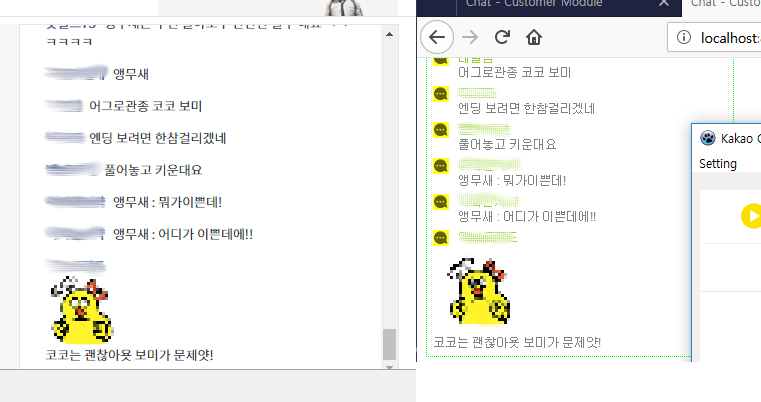

# kakaotv_chat_simple
simple kakao tv chat extraction app

It's basic chat message extraction and rebuild message for another web access.
No re-tranmission between kakaotv server and brwoser client.

port 8090 for webserver.
port 8092 for chatring message by websocket.
port 8094 for alert message by websocket.

httplog.htm for http get message url.
more usage infomation is on doc folder files.

store emoticon images in doc/img folder.

webserver by lnet.
websocket by moRMot.  https://github.com/synopse/mORMot

CEF 3.3071
http://opensource.spotify.com/cefbuilds/cef_binary_3.3071.1649.g98725e6_windows32.tar.bz2

